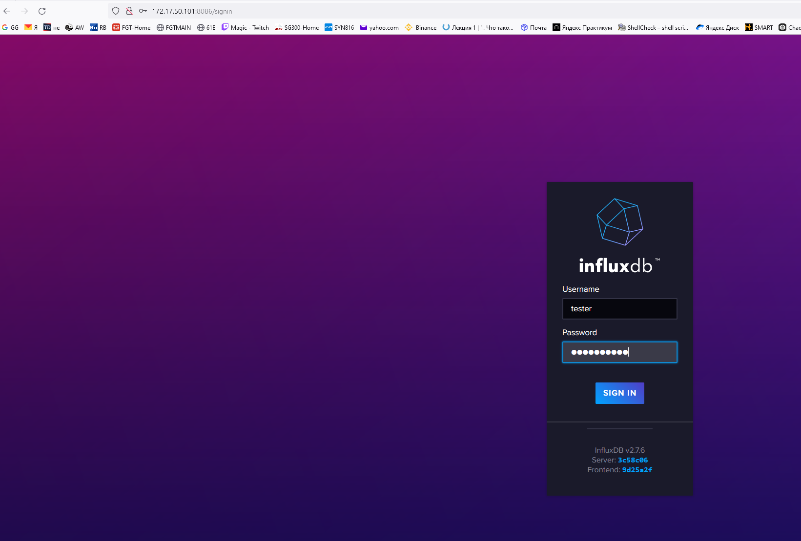
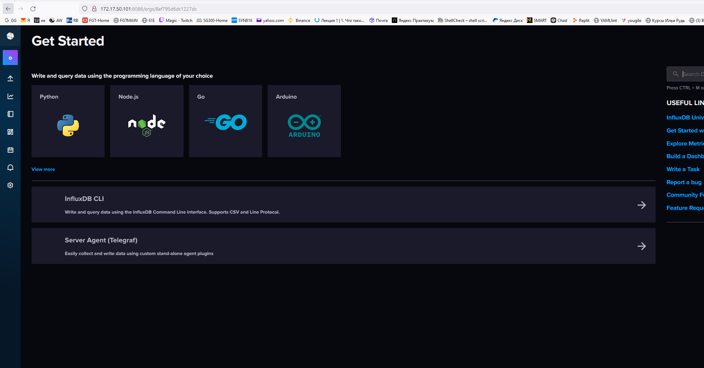
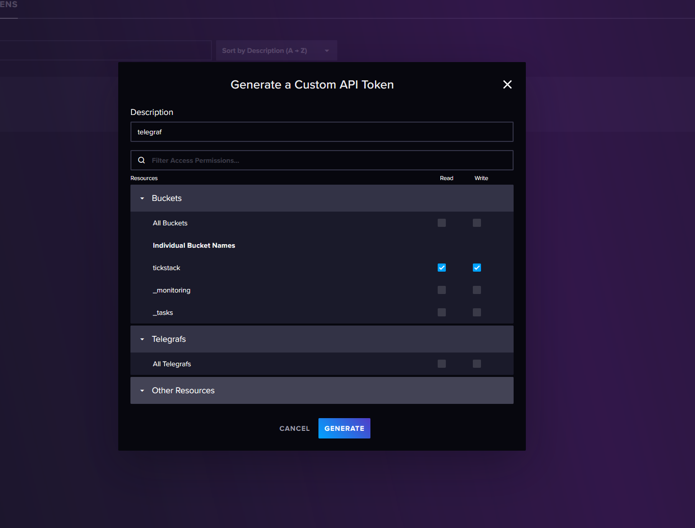
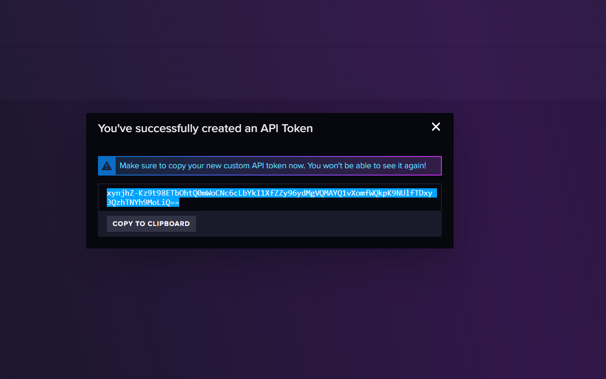
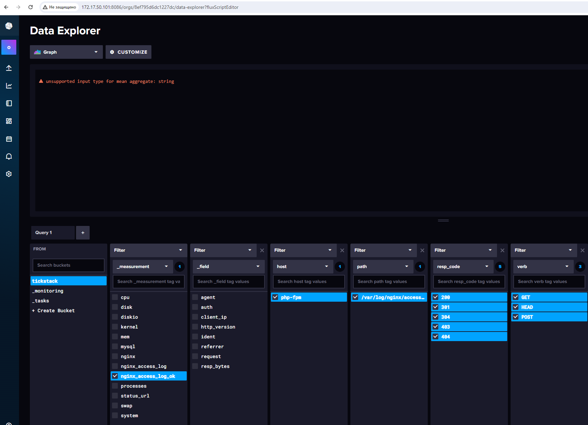
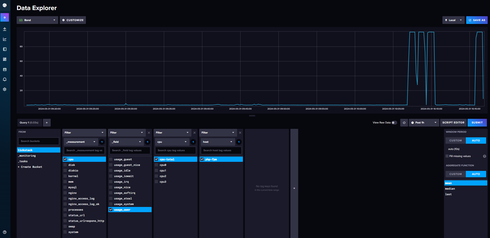
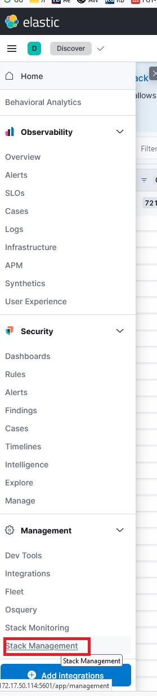
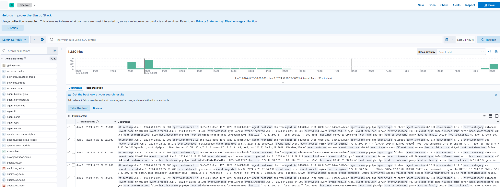

## Домашнее задание 1

<details>
Установка и настройка Prometheus, использование exporters

Цель:

Установить и настроить Prometheus.
Результатом выполнения данного ДЗ будет являться публичный репозиторий, в системе контроля версий (Github, Gitlab, etc.), в котором будет находиться Readme с описанием выполненых действий.

Описание/Пошаговая инструкция выполнения домашнего задания:

Файлы конфигурации prometheus и alertmanager должны находиться в директории GAP-1.

Описание ДЗ:

На виртуальной машине установите любую open source CMS, которая включает в себя следующие компоненты: nginx, php-fpm, database (MySQL or Postgresql).
На этой же виртуальной машине установите Prometheus exporters для сбора метрик со всех компонентов системы (начиная с VM и заканчивая DB, не забудьте про blackbox exporter, который будет проверять доступность вашей CMS).
На этой же или дополнительной виртуальной машине установите Prometheus, задачей которого будет раз в 5 секунд собирать метрики с экспортеров.

### Решение:
Устанавливаем CMS Wordpress с использованием MYSQL, Nginx, Php-fpm.


Устанавливаем Prometheus и необходимые экспортеры.

Пишем юниты для экспортеров и добавляем их в автозагрузку.

Настраиваем экспортеры и проверяем, через prometheus.


</details>


## Домашнее задание 5

### Задача

Настройка zabbix, создание LLD, оповещение на основе триггеров

Цель:
Установить и настроить zabbix, настроить автоматическую отправку аллертов в телеграмм канал.


Описание/Пошаговая инструкция выполнения домашнего задания:
Необходимо сформировать скрипт генерирующий метрики формата:

```
otus_important_metrics[metric1]
otus_important_metrics[metric2]
otus_important_metrics[metric3]

```

С рандомным значение от 0 до 100

Создать правила LLD для обнаружения этих метрик и автоматического добавления триггеров. Триггер должен срабатывать тогда, когда значение больше или равно 95.

Реализовать автоматическую отправку уведомлений в телеграмм канал.

В качестве результаты выполнения ДЗ необходимо предоставить скрипт генерации метрик, скриншоты графиков полученных метрик, ссылку на телеграмм канал с уже отпраленными уведомлениями.


Решение:

<details>

На пк с установленным zabbix client в папке /etc/zabbix/zabbix_agentd.conf.d создаём файл lld.conf c содержимым:

```
UserParameter=otus.discovery,/tmp/sender_test.sh

```

Создаём в папке /tmp/ скрипт с содержимым sender_test.sh


```
#!/bin/bash

# send back discovery key, list of all available array keys
# for a discovery type of "Zabbix agent"
cat << EOF
{ "data": [
  { "{#ITEMNAME}":"otus_important_metrics1" },
  { "{#ITEMNAME}":"otus_important_metrics2" },
  { "{#ITEMNAME}":"otus_important_metrics3" }
]}
EOF

# now take advantage of this invocation to send back values
# build up list of values in /tmp/zdata.txt
agenthost="ubt-wp"
zserver="172.17.50.101"
zport="10051"

cat /dev/null > /tmp/zdata.txt
for item in "otus_important_metrics1" "otus_important_metrics2" "otus_important_metrics3"; do
  randNum="$(( (RANDOM % 100)+1 ))"
  echo $agenthost warning[$item] $randNum >> /tmp/zdata.txt
done

# push all these trapper values back to zabbix
zabbix_sender -vv -z $zserver -p $zport -i /tmp/zdata.txt >> /tmp/zsender.log 2>&1


```

Создаём в папке tmp файлы zdata.txt и zsender.log :

```
touch /tmp/zdata.txt
touch /tmp/zsender.log
```


Назначем владельцев и права на файлы:

```
chown zabbix:zabbix /tmp/z*.*
chmod 664 /tmp/z*.*
chown zabbix:zabbix /tmp/produce.sh
chmod 755 /tmp/produce.sh
```

Проверяем выполнение скрипта:
```
su -c "/tmp/sender_test.sh" -s /bin/sh zabbix
```

Создаём шаблон otus.lld на сервере zabbix


Добавляем в шаблон правило обнаружения


Создаём в шаблоне item prototype


Добавляем шаблон к хосту ubt-wp(ubuntu 22.04 server)

Проверяем что метрики меняются


Настраиваем warnings с разными уровнями значимости и проверяем что они работают:


Подключение телеграм бота

Находим в ТГ @BotFather и командой /newbot создаём нового бота, сохраняем его токен,
добавляем его в наш список контактов.

У бота @getmyid_bot получаем наш ID(chat_id).

Проверяем, что бот отправляет уведомления:

```
curl --header 'Content-Type: application/json' --request 'POST' --data '{"chat_id":"наш_чат_id","text":"Проверочное сообщение"}' "https://api.telegram.org/имя_бота:токен_бота/sendMessage"
```

Alerts - media types - настраиваем оповещение через ТГ


Alerts - Actios - trigger action - включаем уведомление для администраторов


Alerts - Actios - trigger action - Operations - настраиваем оповещение администраторов через ТГ.


Проверяем ТГ.


Скриншоты графиков полученных метрик


</details>

## Домашнее задание 5

### Задача

На виртуальной машине установите любую open source CMS, которая включает в себя следующие компоненты: nginx, php-fpm, database (MySQL or Postgresql);
На этой же виртуальной машине установите Telegraf для сбора метрик со всех компонентов системы (начиная с VM и заканчивая DB);
На этой же или дополнительной виртуальной машине установите Influxdb, Chronograf, Kapacitor
Настройте отправку метрик в InfluxDB.
Создайте сводный дашборд с самыми на ваш взгляд важными графиками, которые позволяют оценить работоспостобность вашей CMS;
Настройте правила алертинга для черезмерного потребления ресурсов, падения компонентов CMS и 500х ошибок;


Решение:

<details>

### Установка InfluxDB


Импортируем ключ репозитория

```
curl -fsSL https://repos.influxdata.com/influxdata-archive_compat.key|sudo gpg --dearmor -o /etc/apt/trusted.gpg.d/influxdata.gpg
```

Добавляем репозиторий

```
echo 'deb [signed-by=/etc/apt/trusted.gpg.d/influxdata.gpg] https://repos.influxdata.com/debian stable main' | sudo tee /etc/apt/sources.list.d/influxdata.list
```

Устанавливаем InfluxDB2, запускаем, проверяем.


```
sudo apt update && sudo apt install influxdb2
sudo systemctl enable --now influxdb
sudo systemctl enable --now influxdb

```

Настраиваем influxdb

```
root@php-fpm:/tmp# influx setup
> Welcome to InfluxDB 2.0!
? Please type your primary username tester
? Please type your password **********
? Please type your password again **********
? Please type your primary organization name otus
? Please type your primary bucket name tickstack
? Please type your retention period in hours, or 0 for infinite 0
? Setup with these parameters?
  Username:          tester
  Organization:      otus
  Bucket:            tickstack
  Retention Period:  infinite
 Yes
User    Organization    Bucket
tester  otus            tickstack
```






Переходим на страницу API Token Page и видим токен с полным доступом, созданный в процессе развертывания.


Создаём отдельный security token для нашего бакета и организации.




Копируем данные нового токена




На этом инсталяция influxDB закончена


### Установка Telegraf


```
sudo apt install telegraf
```

Настраиваем telegraf

vim /etc/telegraf/telegraf.conf


```


### Проверка ответа по http от сервера, раздел INPUTS PLugin


 [[inputs.http_response]]
#   ## List of urls to query.
#
#
name_override = "status_url"
urls = ["http://172.17.50.101", "http://172.17.50.100"]
#   ## Set http_proxy.
#   ## Telegraf uses the system wide proxy settings if it's is not set.
#   # http_proxy = "http://localhost:8888"
#
#   ## Set response_timeout (default 5 seconds)
response_timeout = "5s"
#
#   ## HTTP Request Method
#   # method = "GET"
#
#   ## Whether to follow redirects from the server (defaults to false)
 follow_redirects = true


### Мониторинг процессора и дисков, раздел INPUTS PLugin

[[inputs.cpu]]
  ## Whether to report per-cpu stats or not
  percpu = true
  ## Whether to report total system cpu stats or not
  totalcpu = true
  ## If true, collect raw CPU time metrics
  collect_cpu_time = false
  ## If true, compute and report the sum of all non-idle CPU states
  ## NOTE: The resulting 'time_active' field INCLUDES 'iowait'!
  report_active = false
  ## If true and the info is available then add core_id and physical_id tags
  core_tags = false


# Read metrics about disk usage by mount point
[[inputs.disk]]
  ## By default stats will be gathered for all mount points.
  ## Set mount_points will restrict the stats to only the specified mount points.
  # mount_points = ["/"]

  ## Ignore mount points by filesystem type.
  ignore_fs = ["tmpfs", "devtmpfs", "devfs", "iso9660", "overlay", "aufs", "squashfs"]

  ## Ignore mount points by mount options.
  ## The 'mount' command reports options of all mounts in parathesis.
  ## Bind mounts can be ignored with the special 'bind' option.
  # ignore_mount_opts = []


# Read metrics about disk IO by device
[[inputs.diskio]]


### Попытка мониторить логи ngix на предмет ошибок, которая не работает в моей версии telegraf


[[inputs.tail]]
files = ["/var/log/nginx/access.log"]

from_beginning = true


name_override = "nginx_access_log_ok"
data_format = "grok"


```

 inputs.tail

Не работает



Проверка мониторинга производительности процессора.


```
stress-ng --cpu 4 --cpu-method matrixprod --metrics --timeout 60
```




### Устанавливаем kapacitor


```
apt install capacitor
```


</details>


## Домашнее задание 6

### Задача

**Установка и настройка отправки данных с помощью Beats.**

Цель:
Научиться отправлять логи, метрики с помощью beats в elasticsearch.

Описание/Пошаговая инструкция выполнения домашнего задания:
Для успешного выполнения дз вам нужно сконфигурировать hearthbeat, filebeat и metricbeat на отправку данных в elasticsearch:

На виртуальной машине установите любую open source CMS, которая включает в себя следующие компоненты: nginx, php-fpm, database (MySQL or Postgresql).
Можно взять из предыдущих заданий; На этой же VM установите filebeat и metricbeat. Filebeat должен собирать логи nginx, php-fpm и базы данных.
Metricbeat должен собирать метрики VM, nginx, базы данных;
Установите на второй VM Elasticsearch и kibana, а также heartbeat;
Heartbeat должен проверять доступность следующих ресурсов: веб адрес вашей CMS и порта БД.


<details>

 <summary>Решение</summary>

## Установка Elastic + Kibana

Добавляем зеркало для установки Elastic + Kibana

```
echo "deb [trusted=yes] https://mirror.yandex.ru/mirrors/elastic/8/ stable main" | sudo tee /etc/apt/sources.list.d/elastic-8.x.list
```


```

apt install elasticsearch

apt install kibana
```

## Устанавливаем на клиенте filebeat

```
echo "deb [trusted=yes] https://mirror.yandex.ru/mirrors/elastic/8/ stable main" | sudo tee /etc/apt/sources.list.d/elastic-8.x.list
apt update
apt install filebeat
```

Иструкция по полному удалению filebeat на Ubuntu

```
    sudo systemctl stop filebeat – Stops the Filebeat service
    sudo apt-get purge filebeat – Uninstalls Filebeat and its configuration files
    sudo rm -r /var/lib/filebeat – Removes Filebeat’s data directory
    sudo rm -r /etc/filebeat – Removes Filebeat’s configuration directory
    sudo rm /etc/apt/sources.list.d/elastic-7.x.list – Removes the Elastic repository
    sudo apt-get update – Updates the package database
    filebeat version – Checks the Filebeat version

```

### настраиваем filebeat


Смотрим какие модули поддерживает filebeat

```
sudo filebeat modules list
```

Включаем модули nginx и mysql

```
sudo filebeat modules enable mysql
sudo filebeat modules enable nginx

```

Настраиваем модуль Mysql

```
vim /etc/filebeat/modules.d/mysql.yml
```

```
# Module: mysql
# Docs: https://www.elastic.co/guide/en/beats/filebeat/8.10/filebeat-module-mysql.html

- module: mysql
  # Error logs
  error:
    enabled: true

    # Set custom paths for the log files. If left empty,
    # Filebeat will choose the paths depending on your OS.
    #var.paths:

  # Slow logs
  slowlog:
    enabled: true

    # Set custom paths for the log files. If left empty,
    # Filebeat will choose the paths depending on your OS.
    #var.paths:

```

Настраиваем модуль Nginx

```
vim /etc/filebeat/modules.d/nginx.yml
```
```
- module: nginx
  # Access logs
  access:
    enabled: true

    # Set custom paths for the log files. If left empty,
    # Filebeat will choose the paths depending on your OS.
    #var.paths:

  # Error logs
  error:
    enabled: false

    # Set custom paths for the log files. If left empty,
    # Filebeat will choose the paths depending on your OS.
    #var.paths:

  # Ingress-nginx controller logs. This is disabled by default. It could be used in Kubernetes environments to parse ingress-nginx logs
  ingress_controller:
    enabled: false
```

Настраиваем основной конфиг Filebeat

```
vim /etc/filebeat/filebeat.yml
```

```
# ---------------------------- Elasticsearch Output ----------------------------
output.elasticsearch:
  # Array of hosts to connect to.
  hosts: ["172.17.50.114:9200"]

  # Protocol - either `http` (default) or `https`.
  protocol: "https"
  ssl.verification_mode: none
  # Authentication credentials - either API key or username/password.
  #api_key: "id:api_key"
  username: "elastic"
  password: "qtgTCx1IemxPqbJ8wj0*"

processors:
  - add_host_metadata:
      when.not.contains.tags: forwarded
  - add_cloud_metadata: ~
  - add_docker_metadata: ~
  - add_kubernetes_metadata: ~


# ============================== Filebeat inputs ===============================

filebeat.inputs:

# Each - is an input. Most options can be set at the input level, so
# you can use different inputs for various configurations.
# Below are the input-specific configurations.

# filestream is an input for collecting log messages from files.
- type: filestream

  # Unique ID among all inputs, an ID is required.
  id: my-filestream-id

  # Change to true to enable this input configuration.
  enabled: false

  # Paths that should be crawled and fetched. Glob based paths.
  paths:
    - /var/log/*.log


```
ssl.verification_mode: none - используется если мы используем самоподписные сертификаты.


Раскоментируем  строчку access.log = /var/log/php.access.log

в /etc/php/8.1/fpm/pool.d/www.conf

Перезапускаем php и filebeat.


## Настройка отображения в kibana

Переходим по адресу Kibana, далее Management-Stack Management-Kibana-Data Views




Создаём Data view


Проверяем получение данных:

Переходим Analytics-Discover


</details>