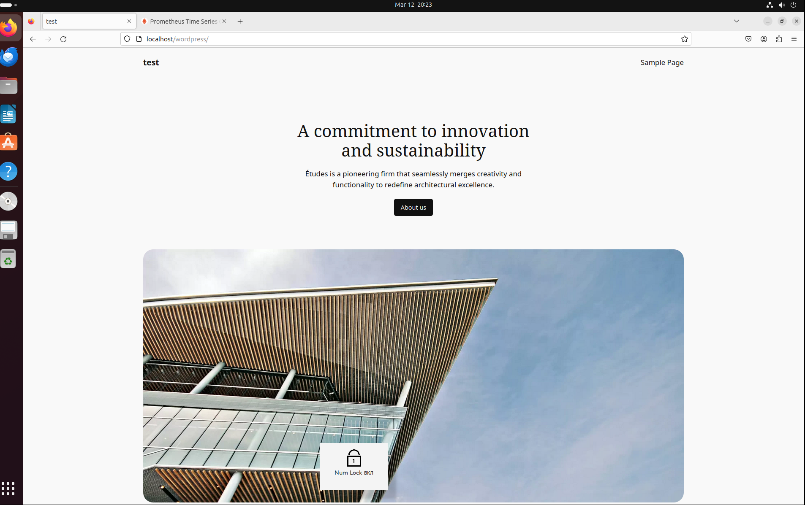
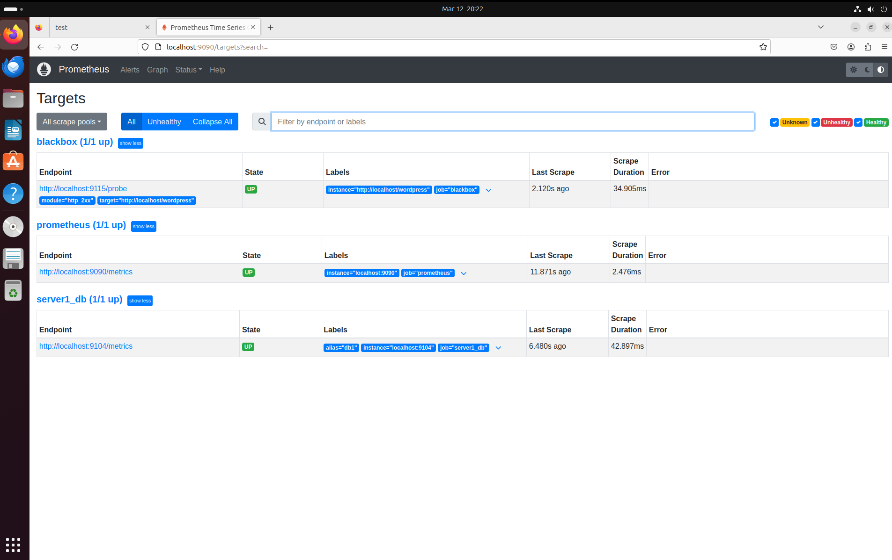

## Домашнее задание 1

Установка и настройка Prometheus, использование exporters

Цель:

Установить и настроить Prometheus.
Результатом выполнения данного ДЗ будет являться публичный репозиторий, в системе контроля версий (Github, Gitlab, etc.), в котором будет находиться Readme с описанием выполненых действий.

Описание/Пошаговая инструкция выполнения домашнего задания:

Файлы конфигурации prometheus и alertmanager должны находиться в директории GAP-1.

Описание ДЗ:

На виртуальной машине установите любую open source CMS, которая включает в себя следующие компоненты: nginx, php-fpm, database (MySQL or Postgresql).
На этой же виртуальной машине установите Prometheus exporters для сбора метрик со всех компонентов системы (начиная с VM и заканчивая DB, не забудьте про blackbox exporter, который будет проверять доступность вашей CMS).
На этой же или дополнительной виртуальной машине установите Prometheus, задачей которого будет раз в 5 секунд собирать метрики с экспортеров.

### Решение:
Устанавливаем CMS Wordpress с использованием MYSQL, Nginx, Php-fpm.

Устанавливаем Prometheus и необходимые экспортеры.

Пишем юниты для экспортеров и добавляем их в автозагрузку.

Настраиваем экспортеры и проверяем, через prometheus.

