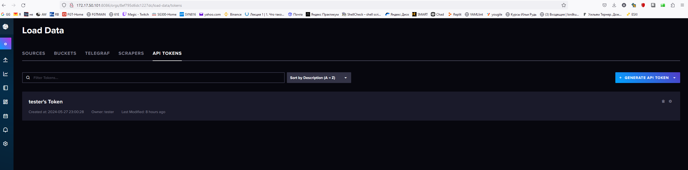
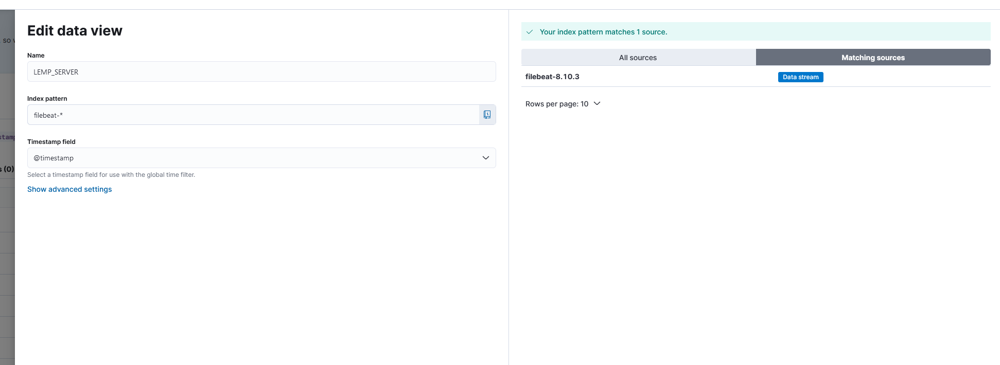
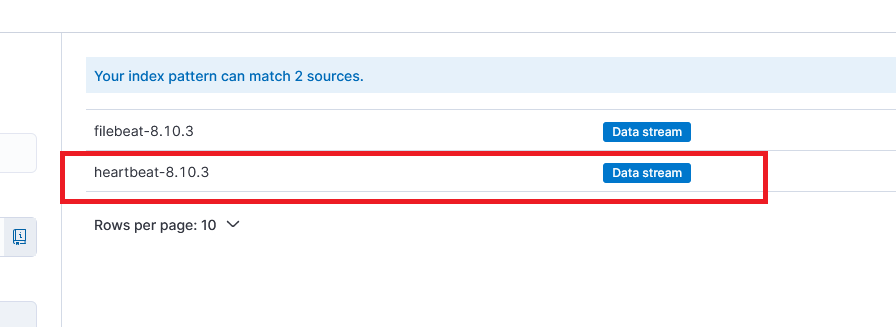
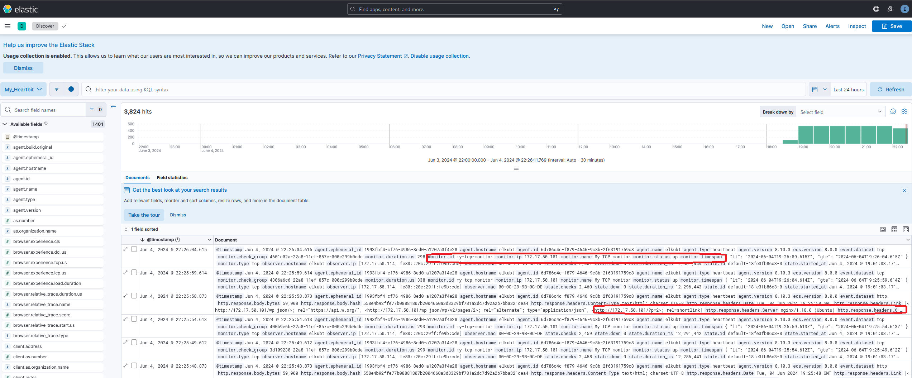
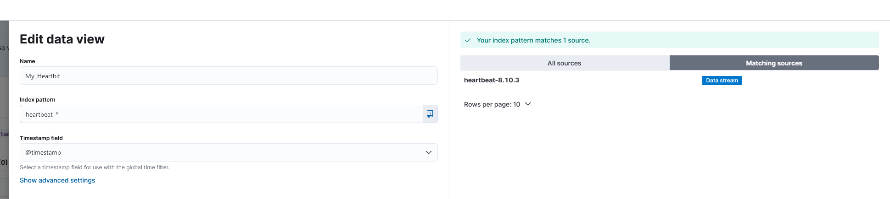
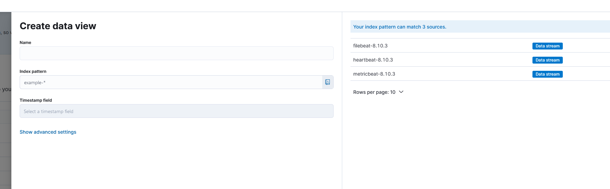
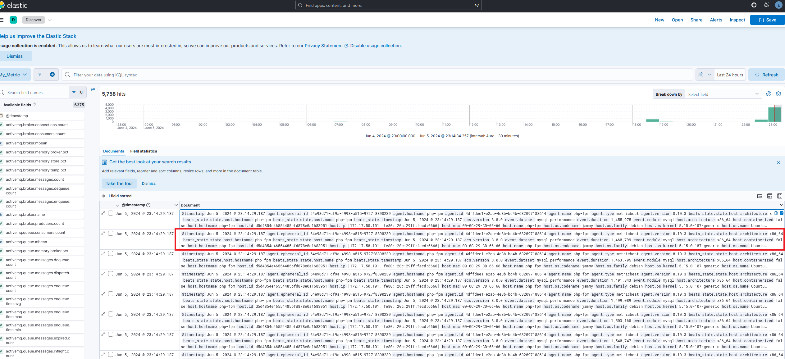
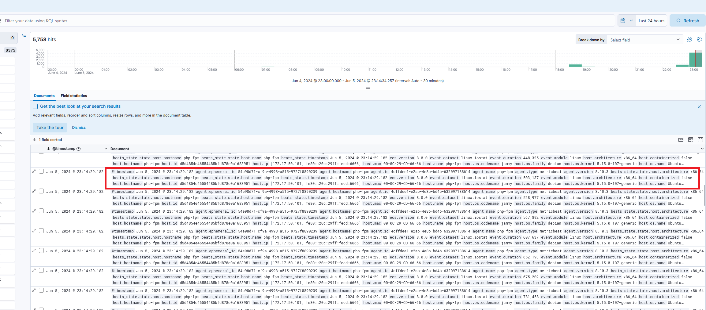

## Домашнее задание 1

<details>
Установка и настройка Prometheus, использование exporters

Цель:

Установить и настроить Prometheus.
Результатом выполнения данного ДЗ будет являться публичный репозиторий, в системе контроля версий (Github, Gitlab, etc.), в котором будет находиться Readme с описанием выполненых действий.

Описание/Пошаговая инструкция выполнения домашнего задания:

Файлы конфигурации prometheus и alertmanager должны находиться в директории GAP-1.

Описание ДЗ:

На виртуальной машине установите любую open source CMS, которая включает в себя следующие компоненты: nginx, php-fpm, database (MySQL or Postgresql).
На этой же виртуальной машине установите Prometheus exporters для сбора метрик со всех компонентов системы (начиная с VM и заканчивая DB, не забудьте про blackbox exporter, который будет проверять доступность вашей CMS).
На этой же или дополнительной виртуальной машине установите Prometheus, задачей которого будет раз в 5 секунд собирать метрики с экспортеров.

### Решение:
Устанавливаем CMS Wordpress с использованием MYSQL, Nginx, Php-fpm.


Устанавливаем Prometheus и необходимые экспортеры.

Пишем юниты для экспортеров и добавляем их в автозагрузку.

Настраиваем экспортеры и проверяем, через prometheus.


</details>


## Домашнее задание 5

### Задача

Настройка zabbix, создание LLD, оповещение на основе триггеров

Цель:
Установить и настроить zabbix, настроить автоматическую отправку аллертов в телеграмм канал.


Описание/Пошаговая инструкция выполнения домашнего задания:
Необходимо сформировать скрипт генерирующий метрики формата:

```
otus_important_metrics[metric1]
otus_important_metrics[metric2]
otus_important_metrics[metric3]

```

С рандомным значение от 0 до 100

Создать правила LLD для обнаружения этих метрик и автоматического добавления триггеров. Триггер должен срабатывать тогда, когда значение больше или равно 95.

Реализовать автоматическую отправку уведомлений в телеграмм канал.

В качестве результаты выполнения ДЗ необходимо предоставить скрипт генерации метрик, скриншоты графиков полученных метрик, ссылку на телеграмм канал с уже отпраленными уведомлениями.


Решение:

<details>

На пк с установленным zabbix client в папке /etc/zabbix/zabbix_agentd.conf.d создаём файл lld.conf c содержимым:

```
UserParameter=otus.discovery,/tmp/sender_test.sh

```

Создаём в папке /tmp/ скрипт с содержимым sender_test.sh


```
#!/bin/bash

# send back discovery key, list of all available array keys
# for a discovery type of "Zabbix agent"
cat << EOF
{ "data": [
  { "{#ITEMNAME}":"otus_important_metrics1" },
  { "{#ITEMNAME}":"otus_important_metrics2" },
  { "{#ITEMNAME}":"otus_important_metrics3" }
]}
EOF

# now take advantage of this invocation to send back values
# build up list of values in /tmp/zdata.txt
agenthost="ubt-wp"
zserver="172.17.50.101"
zport="10051"

cat /dev/null > /tmp/zdata.txt
for item in "otus_important_metrics1" "otus_important_metrics2" "otus_important_metrics3"; do
  randNum="$(( (RANDOM % 100)+1 ))"
  echo $agenthost warning[$item] $randNum >> /tmp/zdata.txt
done

# push all these trapper values back to zabbix
zabbix_sender -vv -z $zserver -p $zport -i /tmp/zdata.txt >> /tmp/zsender.log 2>&1


```

Создаём в папке tmp файлы zdata.txt и zsender.log :

```
touch /tmp/zdata.txt
touch /tmp/zsender.log
```


Назначем владельцев и права на файлы:

```
chown zabbix:zabbix /tmp/z*.*
chmod 664 /tmp/z*.*
chown zabbix:zabbix /tmp/produce.sh
chmod 755 /tmp/produce.sh
```

Проверяем выполнение скрипта:
```
su -c "/tmp/sender_test.sh" -s /bin/sh zabbix
```

Создаём шаблон otus.lld на сервере zabbix


Добавляем в шаблон правило обнаружения


Создаём в шаблоне item prototype


Добавляем шаблон к хосту ubt-wp(ubuntu 22.04 server)

Проверяем что метрики меняются


Настраиваем warnings с разными уровнями значимости и проверяем что они работают:


Подключение телеграм бота

Находим в ТГ @BotFather и командой /newbot создаём нового бота, сохраняем его токен,
добавляем его в наш список контактов.

У бота @getmyid_bot получаем наш ID(chat_id).

Проверяем, что бот отправляет уведомления:

```
curl --header 'Content-Type: application/json' --request 'POST' --data '{"chat_id":"наш_чат_id","text":"Проверочное сообщение"}' "https://api.telegram.org/имя_бота:токен_бота/sendMessage"
```

Alerts - media types - настраиваем оповещение через ТГ


Alerts - Actios - trigger action - включаем уведомление для администраторов


Alerts - Actios - trigger action - Operations - настраиваем оповещение администраторов через ТГ.


Проверяем ТГ.


Скриншоты графиков полученных метрик


</details>

## Домашнее задание 5

### Задача

На виртуальной машине установите любую open source CMS, которая включает в себя следующие компоненты: nginx, php-fpm, database (MySQL or Postgresql);
На этой же виртуальной машине установите Telegraf для сбора метрик со всех компонентов системы (начиная с VM и заканчивая DB);
На этой же или дополнительной виртуальной машине установите Influxdb, Chronograf, Kapacitor
Настройте отправку метрик в InfluxDB.
Создайте сводный дашборд с самыми на ваш взгляд важными графиками, которые позволяют оценить работоспостобность вашей CMS;
Настройте правила алертинга для черезмерного потребления ресурсов, падения компонентов CMS и 500х ошибок;


Решение:

<details>

### Установка InfluxDB


Импортируем ключ репозитория

```
curl -fsSL https://repos.influxdata.com/influxdata-archive_compat.key|sudo gpg --dearmor -o /etc/apt/trusted.gpg.d/influxdata.gpg
```

Добавляем репозиторий

```
echo 'deb [signed-by=/etc/apt/trusted.gpg.d/influxdata.gpg] https://repos.influxdata.com/debian stable main' | sudo tee /etc/apt/sources.list.d/influxdata.list
```

Устанавливаем InfluxDB2, запускаем, проверяем.


```
sudo apt update && sudo apt install influxdb2
sudo systemctl enable --now influxdb
sudo systemctl enable --now influxdb

```

Настраиваем influxdb

```
root@php-fpm:/tmp# influx setup
> Welcome to InfluxDB 2.0!
? Please type your primary username tester
? Please type your password **********
? Please type your password again **********
? Please type your primary organization name otus
? Please type your primary bucket name tickstack
? Please type your retention period in hours, or 0 for infinite 0
? Setup with these parameters?
  Username:          tester
  Organization:      otus
  Bucket:            tickstack
  Retention Period:  infinite
 Yes
User    Organization    Bucket
tester  otus            tickstack
```


Переходим на страницу API Token Page и видим токен с полным доступом, созданный в процессе развертывания.




Создаём отдельный security token для нашего бакета и организации.


Копируем данные нового токена


На этом инсталяция influxDB закончена


### Установка Telegraf


```
sudo apt install telegraf
```

Настраиваем telegraf

vim /etc/telegraf/telegraf.conf


```


### Проверка ответа по http от сервера, раздел INPUTS PLugin


 [[inputs.http_response]]
#   ## List of urls to query.
#
#
name_override = "status_url"
urls = ["http://172.17.50.101", "http://172.17.50.100"]
#   ## Set http_proxy.
#   ## Telegraf uses the system wide proxy settings if it's is not set.
#   # http_proxy = "http://localhost:8888"
#
#   ## Set response_timeout (default 5 seconds)
response_timeout = "5s"
#
#   ## HTTP Request Method
#   # method = "GET"
#
#   ## Whether to follow redirects from the server (defaults to false)
 follow_redirects = true


### Мониторинг процессора и дисков, раздел INPUTS PLugin

[[inputs.cpu]]
  ## Whether to report per-cpu stats or not
  percpu = true
  ## Whether to report total system cpu stats or not
  totalcpu = true
  ## If true, collect raw CPU time metrics
  collect_cpu_time = false
  ## If true, compute and report the sum of all non-idle CPU states
  ## NOTE: The resulting 'time_active' field INCLUDES 'iowait'!
  report_active = false
  ## If true and the info is available then add core_id and physical_id tags
  core_tags = false


# Read metrics about disk usage by mount point
[[inputs.disk]]
  ## By default stats will be gathered for all mount points.
  ## Set mount_points will restrict the stats to only the specified mount points.
  # mount_points = ["/"]

  ## Ignore mount points by filesystem type.
  ignore_fs = ["tmpfs", "devtmpfs", "devfs", "iso9660", "overlay", "aufs", "squashfs"]

  ## Ignore mount points by mount options.
  ## The 'mount' command reports options of all mounts in parathesis.
  ## Bind mounts can be ignored with the special 'bind' option.
  # ignore_mount_opts = []


# Read metrics about disk IO by device
[[inputs.diskio]]


### Попытка мониторить логи ngix на предмет ошибок, которая не работает в моей версии telegraf


[[inputs.tail]]
files = ["/var/log/nginx/access.log"]

from_beginning = true


name_override = "nginx_access_log_ok"
data_format = "grok"


```

 inputs.tail

Не работает


Проверка мониторинга производительности процессора.


```
stress-ng --cpu 4 --cpu-method matrixprod --metrics --timeout 60
```


### Устанавливаем kapacitor


```
apt install capacitor
```


</details>


## Домашнее задание 6

### Задача

**Установка и настройка отправки данных с помощью Beats.**

Цель:
Научиться отправлять логи, метрики с помощью beats в elasticsearch.

Описание/Пошаговая инструкция выполнения домашнего задания:
Для успешного выполнения дз вам нужно сконфигурировать hearthbeat, filebeat и metricbeat на отправку данных в elasticsearch:

На виртуальной машине установите любую open source CMS, которая включает в себя следующие компоненты: nginx, php-fpm, database (MySQL or Postgresql).
Можно взять из предыдущих заданий; На этой же VM установите filebeat и metricbeat. Filebeat должен собирать логи nginx, php-fpm и базы данных.
Metricbeat должен собирать метрики VM, nginx, базы данных;
Установите на второй VM Elasticsearch и kibana, а также heartbeat;
Heartbeat должен проверять доступность следующих ресурсов: веб адрес вашей CMS и порта БД.


<details>

 <summary>Решение</summary>

172.17.50.114/24 -  elkubt - виртуалка с установленными elasticserarc и kibana.

172.17.50.101/24 - php-fpm - виртуалка с LEMP стек + wordpress


## Установка Elastic + Kibana

Добавляем зеркало для установки Elastic + Kibana

```
echo "deb [trusted=yes] https://mirror.yandex.ru/mirrors/elastic/8/ stable main" | sudo tee /etc/apt/sources.list.d/elastic-8.x.list
```


```

apt install elasticsearch

apt install kibana
```


```
root@elkubt:/etc# vim kibana/kibana.yml 

# =================== System: Kibana Server (Optional) ===================
# Enables SSL and paths to the PEM-format SSL certificate and SSL key files, respectively.
# These settings enable SSL for outgoing requests from the Kibana server to the browser.
#server.ssl.enabled: false
#server.ssl.certificate: /path/to/your/server.crt
#server.ssl.key: /path/to/your/server.key

# =================== System: Elasticsearch ===================
# The URLs of the Elasticsearch instances to use for all your queries.
elasticsearch.hosts: ["https://localhost:9200"]

# If your Elasticsearch is protected with basic authentication, these settings provide
# the username and password that the Kibana server uses to perform maintenance on the Kibana
# index at startup. Your Kibana users still need to authenticate with Elasticsearch, which
# is proxied through the Kibana server.
elasticsearch.username: "kibana_system"
elasticsearch.password: "ua7lzkqq_TIqa-bX*h2H"

```


## Устанавливаем на клиенте filebeat

```
echo "deb [trusted=yes] https://mirror.yandex.ru/mirrors/elastic/8/ stable main" | sudo tee /etc/apt/sources.list.d/elastic-8.x.list
apt update
apt install filebeat
```

Иструкция по полному удалению filebeat на Ubuntu

```
    sudo systemctl stop filebeat – Stops the Filebeat service
    sudo apt-get purge filebeat – Uninstalls Filebeat and its configuration files
    sudo rm -r /var/lib/filebeat – Removes Filebeat’s data directory
    sudo rm -r /etc/filebeat – Removes Filebeat’s configuration directory
    sudo rm /etc/apt/sources.list.d/elastic-7.x.list – Removes the Elastic repository
    sudo apt-get update – Updates the package database
    filebeat version – Checks the Filebeat version

```

### настраиваем filebeat

На  сервере с wordpress:

Смотрим какие модули поддерживает filebeat

```
sudo filebeat modules list
```

Включаем модули nginx и mysql

```
sudo filebeat modules enable mysql
sudo filebeat modules enable nginx

```

Настраиваем модуль Mysql

```
vim /etc/filebeat/modules.d/mysql.yml
```

```
# Module: mysql
# Docs: https://www.elastic.co/guide/en/beats/filebeat/8.10/filebeat-module-mysql.html

- module: mysql
  # Error logs
  error:
    enabled: true

    # Set custom paths for the log files. If left empty,
    # Filebeat will choose the paths depending on your OS.
    #var.paths:

  # Slow logs
  slowlog:
    enabled: true

    # Set custom paths for the log files. If left empty,
    # Filebeat will choose the paths depending on your OS.
    #var.paths:

```

Настраиваем модуль Nginx

```
vim /etc/filebeat/modules.d/nginx.yml
```
```
- module: nginx
  # Access logs
  access:
    enabled: true

    # Set custom paths for the log files. If left empty,
    # Filebeat will choose the paths depending on your OS.
    #var.paths:

  # Error logs
  error:
    enabled: false

    # Set custom paths for the log files. If left empty,
    # Filebeat will choose the paths depending on your OS.
    #var.paths:

  # Ingress-nginx controller logs. This is disabled by default. It could be used in Kubernetes environments to parse ingress-nginx logs
  ingress_controller:
    enabled: false
```

Настраиваем основной конфиг Filebeat

```
vim /etc/filebeat/filebeat.yml
```

```
# ---------------------------- Elasticsearch Output ----------------------------
output.elasticsearch:
  # Array of hosts to connect to.
  hosts: ["172.17.50.114:9200"]

  # Protocol - either `http` (default) or `https`.
  protocol: "https"
  ssl.verification_mode: none
  # Authentication credentials - either API key or username/password.
  #api_key: "id:api_key"
  username: "elastic"
  password: "qtgTCx1IemxPqbJ8wj0*"

processors:
  - add_host_metadata:
      when.not.contains.tags: forwarded
  - add_cloud_metadata: ~
  - add_docker_metadata: ~
  - add_kubernetes_metadata: ~


# ============================== Filebeat inputs ===============================

filebeat.inputs:

# Each - is an input. Most options can be set at the input level, so
# you can use different inputs for various configurations.
# Below are the input-specific configurations.

# filestream is an input for collecting log messages from files.
- type: filestream

  # Unique ID among all inputs, an ID is required.
  id: my-filestream-id

  # Change to true to enable this input configuration.
  enabled: false

  # Paths that should be crawled and fetched. Glob based paths.
  paths:
    - /var/log/*.log


```
ssl.verification_mode: none - используется если мы используем самоподписные сертификаты.


Раскоментируем  строчку access.log = /var/log/php.access.log

в /etc/php/8.1/fpm/pool.d/www.conf

Перезапускаем php и filebeat.


## Настройка отображения в kibana

Переходим по адресу Kibana, далее Management-Stack Management-Kibana-Data Views


Создаём Data view




Проверяем получение данных:

Переходим Analytics-Discover, проверяем работу.


### Настраиваем heartbeat

На  сервере с Elasticsearch:

устанавливаем hearbeat

```
apt install heartbeat-elastic 

```

настраиваем конфиг heatbeat

```
vim /etc/heartbeat/heartbeat.yml
```

```
# ---------------------------- Elasticsearch Output ----------------------------
output.elasticsearch:
  # Array of hosts to connect to.
  hosts: ["172.17.50.114:9200"]
  # Protocol - either `http` (default) or `https`.
  protocol: "https"
  ssl.verification_mode: none
  # Authentication credentials - either API key or username/password.
  #api_key: "id:api_key"
  username: "elastic"
  password: "qtgTCx1IemxPqbJ8wj0*"

```

```
############################# Heartbeat ######################################

# Define a directory from which to load monitor definitions. Definitions take the form
# of individual yaml files.
heartbeat.config.monitors:
  # Directory + glob pattern to search for configuration files
  path: ${path.config}/monitors.d/*.yml
  # If enabled, heartbeat will periodically check the config.monitors path for changes
  reload.enabled: false
  # How often to check for changes
  reload.period: 5s

# Configure monitors inline
heartbeat.monitors:
- type: http
  # Set enabled to true (or delete the following line) to enable this monitor
  enabled: true
  # ID used to uniquely identify this monitor in Elasticsearch even if the config changes
  id: my-monitor
  # Human readable display name for this service in Uptime UI and elsewhere
  name: My Monitor
  # List of URLs to query
  urls: ["http://172.17.50.101/sample-page/"]
  # Configure task schedule
  schedule: '@every 10s'
  # Total test connection and data exchange timeout
  #timeout: 16s
  # Name of corresponding APM service, if Elastic APM is in use for the monitored service.
  #service.name: my-apm-service-name

# Experimental: Set this to true to run heartbeat monitors exactly once at startup
#heartbeat.run_once: true

# ======================= Elasticsearch template setting =======================

setup.template.settings:
  index.number_of_shards: 1
  index.codec: best_compression
  #_source.enabled: false

```


Подготавливаем файл для мониторинга порта 3306 по TCP на сервере wordpress.

```
cp sample.tcp.yml.disabled sample.tcp.yml
```


```
root@elkubt:/etc/heartbeat/monitors.d# vim sample.tcp.yml

# These files contain a list of monitor configurations identical
# to the heartbeat.monitors section in heartbeat.yml
# The .example extension on this file must be removed for it to
# be loaded.

- type: tcp # monitor type `tcp`. Connect via TCP and optionally verify endpoint
  # by sending/receiving a custom payload

  # ID used to uniquely identify this monitor in elasticsearch even if the config changes
  id: my-tcp-monitor

  # Human readable display name for this service in Uptime UI and elsewhere
  name: My TCP monitor

  # Name of corresponding APM service, if Elastic APM is in use for the monitored service.
  #service.name: my-apm-service-name

  # Enable/Disable monitor
  #enabled: true

  # Configure task schedule
  schedule: '@every 5s' # every 5 seconds from start of beat

  # configure hosts to ping.
  # Entries can be:
  #   - plain host name or IP like `localhost`:
  #       Requires ports configs to be checked. If ssl is configured,
  #       a SSL/TLS based connection will be established. Otherwise plain tcp connection
  #       will be established
  #   - hostname + port like `localhost:12345`:
  #       Connect to port on given host. If ssl is configured,
  #       a SSL/TLS based connection will be established. Otherwise plain tcp connection
  #       will be established
  #   - full url syntax. `scheme://<host>:[port]`. The `<scheme>` can be one of
  #     `tcp`, `plain`, `ssl` and `tls`. If `tcp`, `plain` is configured, a plain
  #     tcp connection will be established, even if ssl is configured.
  #     Using `tls`/`ssl`, an SSL connection is established. If no ssl is configured,
  #     system defaults will be used (not supported on windows).
  #     If `port` is missing in url, the ports setting is required.
  hosts: ["172.17.50.101:3306"]

  # Configure IP protocol types to ping on if hostnames are configured.
  # Ping all resolvable IPs if `mode` is `all`, or only one IP if `mode` is `any`.
  ipv4: true
  ipv6: false
  mode: any
```


На сервере с MYSQL - разрешаем подключение к порту 3306 в MYSQL

```
vim /etc/mysql/mysql.conf.d/mysqld.cnfvim /etc/mysql/mysql.conf.d/mysqld.cnf
```

правим значение

```
bind-address            = 0.0.0.0
```

перезапускаем и проверяем:

```
systemctl restart mysql.service

root@php-fpm:/var/log# ss -tulpn | grep 3306 
tcp   LISTEN 0      151                0.0.0.0:3306       0.0.0.0:*    users:(("mysqld",pid=29695,fd=23))
```

Переходим на сервер с heatbeat

Проверяем работоспособность конфига (для проверки heartbeat должен быть остановлен)

```
heartbeat -e -c heartbeat.yml
```

Запускаем heartbeat

```
systemctl start heartbeat-elastic.service 
systemctl enable heartbeat-elastic.service
systemctl status heartbeat-elastic.service  
```

Переходим на сайт kibana

Home - Management - Stack management - Kibana - DataViews

Выбираем Create data view и видим, что у нас появился новый источник данных



Создаём новый Data View



### Проверяем работу:

Home - Analytics - Discover - Выбираем наш Data View

Проверяем что БД и сайт мониторятся




### Установка и настройка metricbeat

На сервере wordpress устанавливаем metricbeat

```
apt install metricbeat
```

```
root@php-fpm:/etc/metricbeat# vim metricbeat.yml

# ---------------------------- Elasticsearch Output ----------------------------
output.elasticsearch:
  # Array of hosts to connect to.
  hosts: ["172.17.50.114:9200"]

  # Protocol - either `http` (default) or `https`.
  protocol: "https"
  ssl.verification_mode: none
  # Authentication credentials - either API key or username/password.
  #api_key: "id:api_key"
  username: "elastic"
  password: "qtgTCx1IemxPqbJ8wj0*"

```

Настраиваем модули metricbeat

```
vim /etc/metricbeat/modules.d/mysql.yml


# Module: mysql
# Docs: https://www.elastic.co/guide/en/beats/metricbeat/8.10/metricbeat-module-mysql.html

- module: mysql
  metricsets:
    - status
  #  - galera_status
    - performance
  #  - query
  period: 10s

  # Host DSN should be defined as "user:pass@tcp(127.0.0.1:3306)/"
  # or "unix(/var/lib/mysql/mysql.sock)/",
  # or another DSN format supported by <https://github.com/Go-SQL-Driver/MySQL/>.
  # The username and password can either be set in the DSN or using the username
  # and password config options. Those specified in the DSN take precedence.
  hosts: ["tcp(127.0.0.1:3306)/"]

  # Username of hosts. Empty by default.
  username: wordpress

  # Password of hosts. Empty by default.
  password: superSecretPassword!123

```

vim /etc/metricbeat/modules.d/nginx.yml


```
# Module: nginx
# Docs: https://www.elastic.co/guide/en/beats/metricbeat/8.10/metricbeat-module-nginx.html

- module: nginx
  #metricsets:
  #  - stubstatus
  period: 10s

  # Nginx hosts
  hosts: ["http://172.17.50.101/sample-page/"]

  # Path to server status. Default nginx_status
  #server_status_path: "nginx_status"

  #username: "user"
  #password: "secret"
~                      


```

```
vim /etc/metricbeat/modules.d/system.yml

# Module: system
# Docs: https://www.elastic.co/guide/en/beats/metricbeat/8.10/metricbeat-module-system.html

- module: system
  period: 10s
  metricsets:
    - cpu
    - load
    - memory
    - network
    - process
    - process_summary
    - socket_summary
    #- entropy
    #- core
    #- diskio
    #- socket
    #- service
    #- users
  process.include_top_n:
    by_cpu: 5      # include top 5 processes by CPU
    by_memory: 5   # include top 5 processes by memory
# Configure the mount point of the host’s filesystem for use in monitoring a host from within a container
# hostfs: "/hostfs"

- module: system
  period: 1m
  metricsets:
    - filesystem
    - fsstat
  processors:
  - drop_event.when.regexp:
      system.filesystem.mount_point: '^/(sys|cgroup|proc|dev|etc|host|lib|snap)($|/)'

- module: system
  period: 15m
  metricsets:
    - uptime

```

Проверяем, что конфиг рабочий:

```
root@php-fpm:/etc/metricbeat# metricbeat -e -c /etc/metricbeat/metricbeat.yml 
```

Запускаем

```
systemctl start metricbeat.service 
systemctl enable metricbeat.service 
systemctl status metricbeat.service 
```

Подключаемся на сервер Kibana

Home - Management - Stack management - Kibana - DataViews

Выбираем Create data view и видим, что у нас появился новый источник данных




Home - Analytics - Discover - Выбираем наш Data View







Отличный сайт с описанием настроек битов https://logit.io/sources/configure/mysql/


</details>